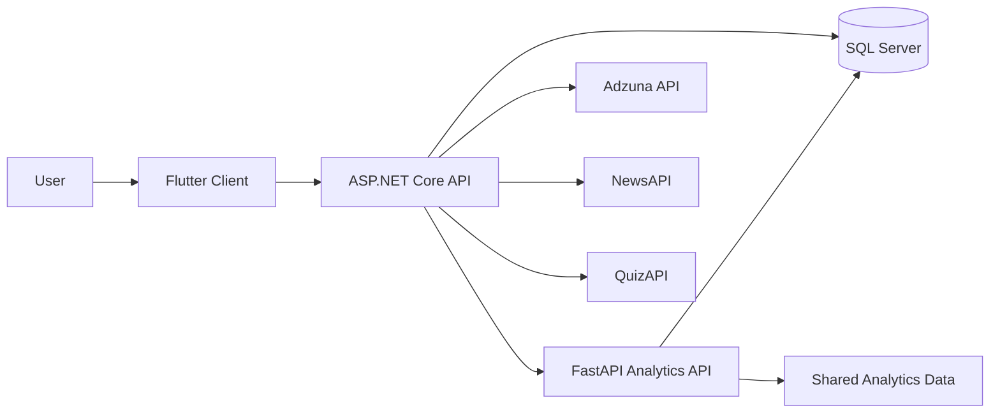
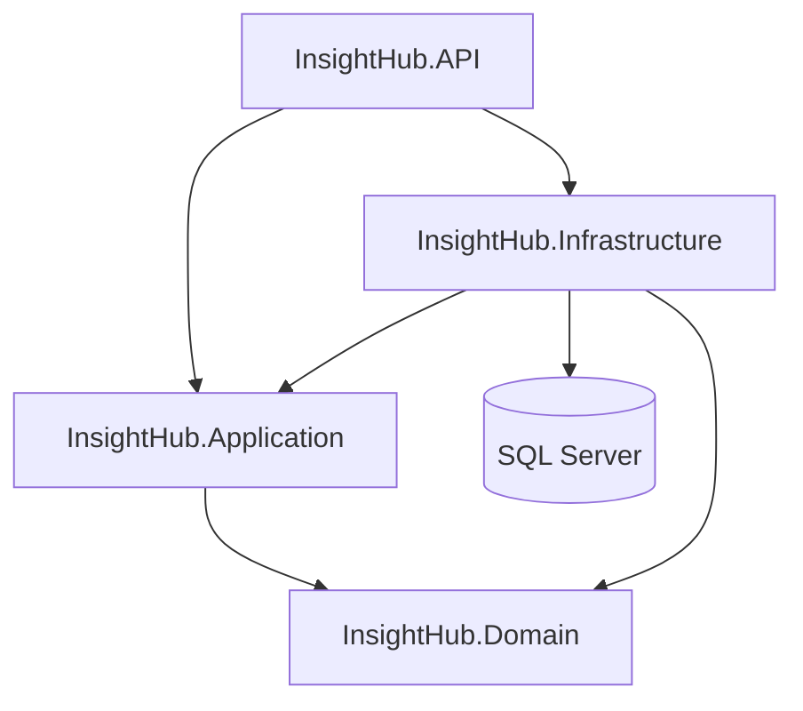
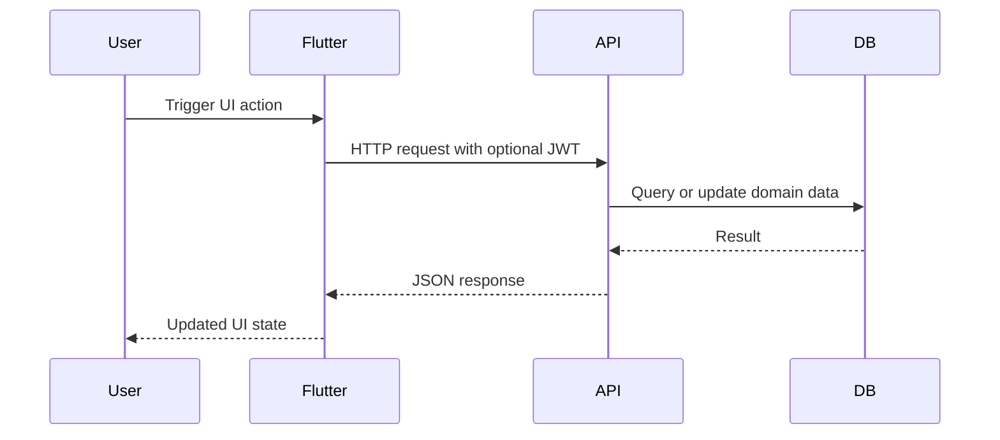
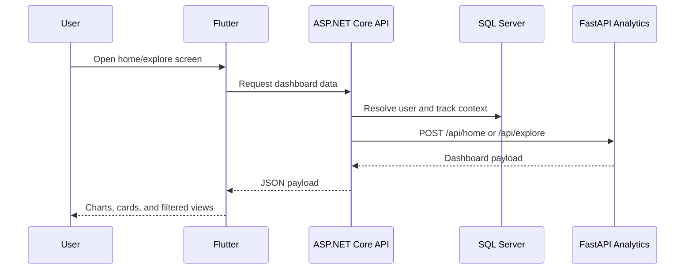
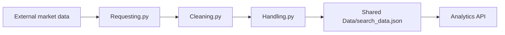

# InsightHub

## Project Overview

InsightHub is a graduation-project platform for career guidance, assessment, and labor-market exploration. It combines a Flutter client, an ASP.NET Core backend, and a Python analytics service to support authentication, profile management, assessment workflows, jobs/news retrieval, and analytics dashboards.

Core capabilities include:

- User registration, login, OTP verification, and profile management
- Employee survey and non-employee career matching workflows
- HR interview quiz generation and result evaluation
- Jobs and news retrieval by selected tracks/categories
- Personalized home/explore analytics dashboards
- Scheduled ingestion and refresh workflows for market data

## User Guide

This section describes how to run the current repository locally after cloning it.

### Repository Structure

| Path | Purpose |
| --- | --- |
| `src/Backend Department` | ASP.NET Core Web API solution |
| `src/Analytics Department` | FastAPI analytics service and data-refresh pipeline |
| `src/Flutter Department` | Flutter client application |

### Required Tools

| Tool | Recommended Version | Why it is needed |
| --- | --- | --- |
| Git | Latest | Clone and update the repository |
| .NET SDK | 10.0 | Backend projects target `net10.0` |
| SQL Server | 2019+ / Express / LocalDB | Primary database and Hangfire storage |
| Python | 3.10+ | Analytics API and refresh scripts |
| Flutter SDK | Stable release compatible with Dart `^3.9.2` | Client build/runtime |
| ODBC Driver 17 for SQL Server | Current Windows version | Needed by the analytics pipeline when using SQL Server |

### Technologies in Use

| Layer | Technologies |
| --- | --- |
| Frontend | Flutter, Dart, `flutter_bloc`, `dio`, `flutter_dotenv`, `flutter_secure_storage`, Syncfusion charts/maps/treemap |
| Backend | ASP.NET Core, EF Core, SQL Server, ASP.NET Identity, JWT, Hangfire, Swagger/OpenAPI |
| Analytics | FastAPI, Uvicorn, Pandas, NumPy, SQLAlchemy, `python-dotenv`, spaCy |
| External APIs | Adzuna Jobs API, NewsAPI, QuizAPI |

### 1. Clone the Repository

```powershell
git clone <repository-url>
cd InsightHub
```

### 2. Backend Setup

The backend solution contains four projects:

- `InsightHub.API`
- `InsightHub.Application`
- `InsightHub.Domain`
- `InsightHub.Infrastructure`

#### Restore dependencies

```powershell
dotnet restore "src/Backend Department/InsightHub.sln"
```

#### Backend configuration

Backend configuration is loaded from:

- `src/Backend Department/InsightHub.API/appsettings.json`
- `src/Backend Department/InsightHub.API/appsettings.Development.json`

Use `appsettings.json` for base/shared defaults and `appsettings.Development.json` for local development overrides.
Both files are in the correct runtime location for ASP.NET Core.

Recommended local values:

```json
{
  "ConnectionStrings": {
    "DefaultConnection": "Server=localhost;Database=InsightHub;Trusted_Connection=True;TrustServerCertificate=True"
  },
  "Jwt": {
    "Key": "replace-with-a-long-random-secret",
    "Issuer": "InsightHub",
    "Audience": "InsightHubUsers"
  },
  "Adzuna": {
    "AppId": "your-adzuna-app-id",
    "AppKey": "your-adzuna-app-key"
  },
  "VerifierEmail": {
    "Email": "your-email@example.com",
    "AppPassword": "your-app-password"
  },
  "NewsApi": {
    "ApiKey": "your-newsapi-key"
  },
  "QuizAPI": {
    "api_key": "your-quizapi-key"
  },
  "DataAnalysis": {
    "BaseUrl": "http://127.0.0.1:8000"
  }
}
```

Practical usage:

- Keep shared defaults in `appsettings.json`.
- Put environment-specific local values in `appsettings.Development.json` while running in Development mode.

Configuration sections used by the backend:

| Section | Used for |
| --- | --- |
| `ConnectionStrings:DefaultConnection` | EF Core, SQL Server, Hangfire storage |
| `Jwt` | Authentication token signing and validation |
| `Adzuna` | Jobs ingestion/query integration |
| `VerifierEmail` | OTP email sending |
| `NewsApi` | News ingestion/query integration |
| `QuizAPI` | Interview questions synchronization |
| `DataAnalysis` | Backend-to-analytics proxy base URL |

#### Database setup

Apply the existing migrations:

```powershell
dotnet ef database update --project "src/Backend Department/InsightHub.Infrastructure" --startup-project "src/Backend Department/InsightHub.API"
```

If `dotnet ef` is not installed:

```powershell
dotnet tool install --global dotnet-ef
```

#### Run the backend

```powershell
dotnet run --project "src/Backend Department/InsightHub.API"
```

Current development URL from [launchSettings.json](</D:/Graduation Projects/Comp Project/InsightHub/src/Backend Department/InsightHub.API/Properties/launchSettings.json>):

- `http://localhost:5043`

Important runtime behavior:

- Swagger UI is enabled in development.
- Hangfire server starts automatically.
- Seed routines run on startup.
- `DummyDataSeeder` may create a substantial set of dummy market users on first run.

### 3. Analytics Service Setup

The analytics section contains:

- `Analytics & Visualization`: FastAPI dashboard API
- `Cleaning & Modeling`: data acquisition, cleaning, caching, and refresh pipeline

#### Create and activate a virtual environment

```powershell
python -m venv .venv
.venv\Scripts\activate
```

#### Install dependencies

```powershell
pip install -r "src/Analytics Department/requirements.txt"
```

#### Configure analytics environment variables

Create or update:

- `src/Analytics Department/.env`

Use [env example.txt](</D:/Graduation Projects/Comp Project/InsightHub/src/Analytics Department/env example.txt>) as the reference.

Recommended local template:

```dotenv
ADZUNA_API_ID=
ADZUNA_APP_KEY=

ANALYST_HOST=127.0.0.1
CHARTS_PORT=8000

DB_TYPE=mssql+pyodbc
DB_DRIVER=ODBC Driver 17 for SQL Server
DB_USER=your_db_user
DB_PASSWORD=your_db_password
BACKEND_HOST=127.0.0.1
DB_PORT=1433
DB_NAME=InsightHub
```

#### Run the analytics API

```powershell
cd "src/Analytics Department/Analytics & Visualization"
python main.py
```

The analytics service exposes:

- `POST /api/home`
- `POST /api/explore`

#### Optional: run the analytics refresh service

[update.py](</D:/Graduation Projects/Comp Project/InsightHub/src/Analytics Department/Cleaning & Modeling/update.py>) is a long-running scheduled process, not a one-shot script. It manages its own run-state file and refreshes data on a timed loop.

Run it in a separate terminal only if you want the local environment to keep refreshing analytics data:

```powershell
cd "src/Analytics Department/Cleaning & Modeling"
python update.py
```

Operational notes:

- The analytics API reads `src/Analytics Department/Shared Data/search_data.json` at startup.
- If the file becomes stale or missing, the analytics API still starts but dashboard responses may be empty or outdated.

### 4. Flutter Client Setup

The Flutter app is now mostly organized around:

- `lib/core`
- `lib/feature`

Legacy folders such as `lib/views`, `lib/widget`, `lib/services`, `lib/model`, and `lib/cuibt` still coexist with the newer structure, so the app is currently in a transitional state rather than a full clean-slate refactor.

#### Install dependencies

```powershell
cd "src/Flutter Department"
flutter pub get
```

#### Configure the frontend API base URL

The current app loads its base URL from:

- `src/Flutter Department/.env`

Use the provided example:

- `src/Flutter Department/.env.example`

Example local value:

```dotenv
BASE_URL=http://localhost:5043/api
```

For Android emulator:

```dotenv
BASE_URL=http://10.0.2.2:5043/api
```

For physical devices, replace `localhost` with the host machine IP accessible from the device.

#### Run the Flutter app

```powershell
flutter run
```

### 5. Recommended Startup Order

Start the system in this order:

1. SQL Server
2. Analytics API
3. ASP.NET Core backend
4. Flutter client
5. Optional analytics refresh process

This order matters because:

- the backend depends on the database
- the backend proxies dashboard requests to the analytics API
- the Flutter app depends on the backend base URL
- the refresh service feeds the analytics data source used by the FastAPI process

### 6. Docker

No `Dockerfile` or `docker-compose` setup is currently documented for this project.

### 7. Troubleshooting

| Issue | Likely cause | Action |
| --- | --- | --- |
| Backend fails with `Jwt:Key is missing` | Missing or invalid config override | Verify `appsettings.Development.json` and `Jwt` settings |
| Backend fails to connect to SQL Server | Invalid `DefaultConnection` | Check SQL Server instance name and permissions |
| OTP flow fails | `VerifierEmail` is missing or invalid | Configure email and app password correctly |
| Interview question sync fails | `QuizAPI:api_key` missing | Add a valid QuizAPI key |
| Analytics endpoints return empty responses | Analytics API unreachable or stale shared data | Start the FastAPI service and verify `DataAnalysis:BaseUrl` |
| Flutter cannot reach the backend | Wrong `BASE_URL` in `.env` | Point it to your local backend URL |
| Jobs/news retrieval is empty | Missing Adzuna or NewsAPI credentials | Configure `Adzuna` and `NewsApi` settings |
| Analytics pipeline fails against SQL Server | Wrong DB settings or missing ODBC driver | Install ODBC Driver 17 and review analytics `.env` |

## System Design & Architecture

### Overall Architecture

InsightHub is a multi-service system with a client app, a transactional backend, and a dedicated analytics service.



### Backend Architecture

The backend follows a layered design.



| Layer | Responsibility |
| --- | --- |
| `InsightHub.API` | Controllers, middleware, authentication, rate limiting, startup configuration |
| `InsightHub.Application` | Contracts, interfaces, DTOs, and view models |
| `InsightHub.Domain` | Entities and enums |
| `InsightHub.Infrastructure` | EF Core persistence, external integrations, seeding, migrations, DI |

### Main Components

#### Backend API

Key controllers:

| Controller | Responsibility |
| --- | --- |
| `AccountController` | Register, login, OTP, profile, logout, account deletion |
| `SurveyController` | Employee survey question retrieval and submission |
| `CareerQuizController` | Non-employee quiz retrieval, full-match submission, stored results |
| `InterviewQuizController` | HR/interview question retrieval and answer submission |
| `UserSubmission` | Determines employment-status-driven flow/navigation |
| `NewsController` | Track-based article retrieval |
| `JobOffersController` | Track-based jobs retrieval |
| `AnalysisProxyController` | Proxies home and explore analytics requests to FastAPI |

Key backend services:

| Service | Responsibility |
| --- | --- |
| `AccountService` | Identity, JWT issuance, OTP verification, profile updates |
| `SurveyService` | Employee assessment workflow |
| `CareerQuizService` | Match calculation and result persistence |
| `CareerQuizDecisionEngine` | Career match decision logic |
| `InterviewQuizService` | HR quiz retrieval and scoring |
| `InterviewQuestionsSyncService` | Pulls questions from QuizAPI |
| `UserSubmissionService` | Employment status and routing state |
| `NewsQueryService` | Reads stored news for API responses |
| `NewsIngestionService` | Refreshes and stores articles |
| `JobOffersQueryService` | Reads stored job offers for API responses |
| `JobSyncService` | Refreshes and stores job offers |
| `AdzunaService` | Outbound jobs API client |
| `NewsService` | Outbound news API client |

#### Analytics Service

The analytics service is built around a reusable `Analyzer` and dynamic dashboard configuration.

| Module | Responsibility |
| --- | --- |
| `Analytics.py` | Analytical operations over the loaded dataset |
| `Configs.py` | Home/explore widget definitions and resolver wiring |
| `Routes.py` | Dynamic page route generation |
| `Services.py` | `PageBuilder` response assembly |
| `main.py` | FastAPI bootstrap and router registration |
| `Cleaning & Modeling/Requesting.py` | Data acquisition client layer |
| `Cleaning & Modeling/Handling.py` | Local file/data handling |
| `Cleaning & Modeling/Caching.py` | Cache management |
| `Cleaning & Modeling/Cleaning.py` | Transformation and cleaning logic |
| `Cleaning & Modeling/update.py` | Long-running scheduled refresh process |

#### Flutter Client

Current frontend structure:

| Area | Responsibility |
| --- | --- |
| `lib/core` | Shared configuration, API services, storage, constants, utilities |
| `lib/feature/app_start` | Splash, onboarding, and welcome flows |
| `lib/feature/auth` | Registration, login, OTP, auth widgets and cubits |
| `lib/feature/home_and_explore` | Dashboard fetching, dynamic widgets, chart rendering |
| `lib/feature/menu_Services/career_and_hr` | Career quiz, HR quiz, navigation, match/result flows |
| `lib/feature/menu_Services/jop_and_news` | Jobs/news cubits, models, views, and widgets |

The current app still references some legacy folders in active startup code, especially for profile/logout screens, which is important when understanding the codebase and maintaining routes.

### Data Flow

#### Standard request flow



#### Analytics dashboard flow



#### Data refresh flow



### Database Design

Primary persistence is implemented through [AppDbContext.cs](</D:/Graduation Projects/Comp Project/InsightHub/src/Backend Department/InsightHub.Infrastructure/Persistence/AppDbContext.cs>).

Key persisted entities:

- application users and identity records
- tracks and category labels
- survey questions, options, and responses
- career quiz results and per-track result rows
- interview questions and options
- job offers
- news articles

Important constraints and behaviors:

- `SurveyResponse` is unique per `(UserId, QuestionId)`.
- `JobOffer.ExternalId` is unique.
- `QuizResult` cascades to related `QuizResultTrack` rows.
- startup seeding initializes baseline reference data and dummy market data

### Scheduled Services

The backend schedules recurring jobs through Hangfire:

- job synchronization: daily at 1:00
- news ingestion: every 12 hours
- interview question synchronization: weekly on Saturday

The analytics Python refresh service separately runs on its own time-window loop and updates the shared dataset consumed by the FastAPI analytics service.

## Implementation Overview

### Implementation Approach

InsightHub is implemented as three cooperating runtimes with clear boundaries:

- Flutter handles navigation, authentication state, secure token storage, and UI rendering.
- ASP.NET Core owns business workflows, persistence, authentication, background jobs, and API composition.
- FastAPI handles analytics computation and dashboard payload construction over a prepared market dataset.

This separation keeps transactional application logic and analytics processing decoupled.

### Core Engineering Decisions

| Decision | Reason |
| --- | --- |
| Layered backend architecture | Separates HTTP, contracts, domain logic, and infrastructure concerns |
| Dedicated analytics service | Keeps heavy data shaping out of the main transactional API |
| Backend analytics proxy | Allows user-context filtering before analytics responses are returned |
| Feature-oriented Flutter structure | Scales frontend code around workflows instead of file types alone |
| Centralized API client and secure storage | Simplifies auth-aware requests and token handling |
| Hangfire background scheduling | Supports data refresh without building a custom scheduler |
| Seeded local data | Makes development and demos usable without manual population |

### Processing Pipelines

#### Authentication and profile pipeline

1. Flutter sends auth/profile requests via `ApiService`.
2. `AccountController` delegates to `AccountService`.
3. Identity and JWT logic execute in the backend.
4. Tokens are stored using secure storage in the client.
5. Unauthorized responses trigger centralized client-side sign-out routing.

#### Assessment pipeline

1. The app requests employment status from `UserSubmission`.
2. The result determines whether the user enters employee survey, non-employee quiz, stored result, or thank-you flow.
3. Answers are submitted to the appropriate backend controller.
4. Results are persisted and later reused for navigation or display.

#### Analytics pipeline

1. The Python refresh process collects and transforms market data.
2. Cleaned output is written to `Shared Data/search_data.json`.
3. FastAPI loads that file into a Pandas DataFrame on startup.
4. `Analyzer` computes KPIs, aggregates, and chart-friendly payloads.
5. `PageBuilder` composes dashboard sections.
6. The backend proxies analytics responses to authenticated clients.

### Patterns and Structure

Patterns visible in the codebase:

- dependency injection in ASP.NET Core
- interface-driven service abstraction
- EF Core repository-through-DbContext style persistence
- builder/configuration-driven analytics responses
- Cubit/BLoC state management in Flutter
- centralized HTTP client handling on the client side

### Scalability and Optimization Considerations

Current strengths:

- analytics processing is isolated from the transactional backend
- external API integrations are encapsulated behind service classes
- recurring jobs reduce manual refresh work
- dashboard rendering is data-driven rather than fully hardcoded
- client auth/network behavior is centralized

Current constraints:

- the Flutter app still mixes legacy and refactored modules
- configuration relies on local values for connection strings, JWT, and external API credentials
- analytics startup depends on loading a local shared JSON file into memory
- external integrations rely on multiple third-party credentials and service availability

### Technical Challenges Inferred from the Code

The current implementation suggests the main engineering challenges were:

- coordinating three runtimes across different languages and toolchains
- aligning backend DTOs, analytics payloads, and frontend rendering contracts
- routing users dynamically based on employment and assessment state
- keeping locally stored jobs/news/questions synchronized from external APIs
- evolving the Flutter codebase while maintaining backward compatibility with older modules

Overall, the current repository reflects a realistic multi-service graduation project with a stronger configuration surface than before, a dedicated analytics subsystem, and a frontend that is actively transitioning toward a more maintainable feature-based architecture.
