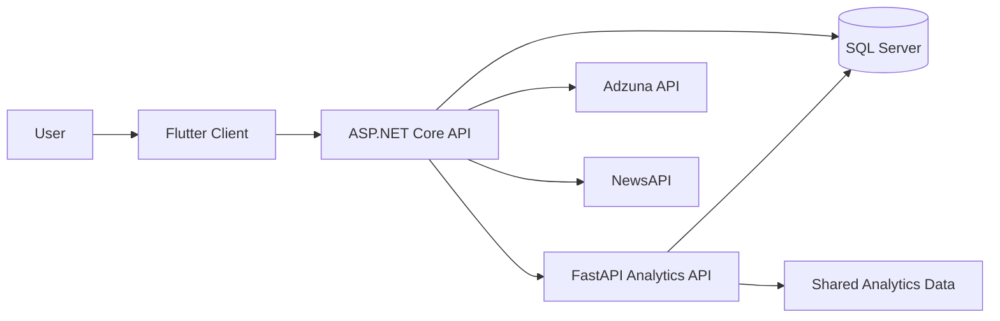
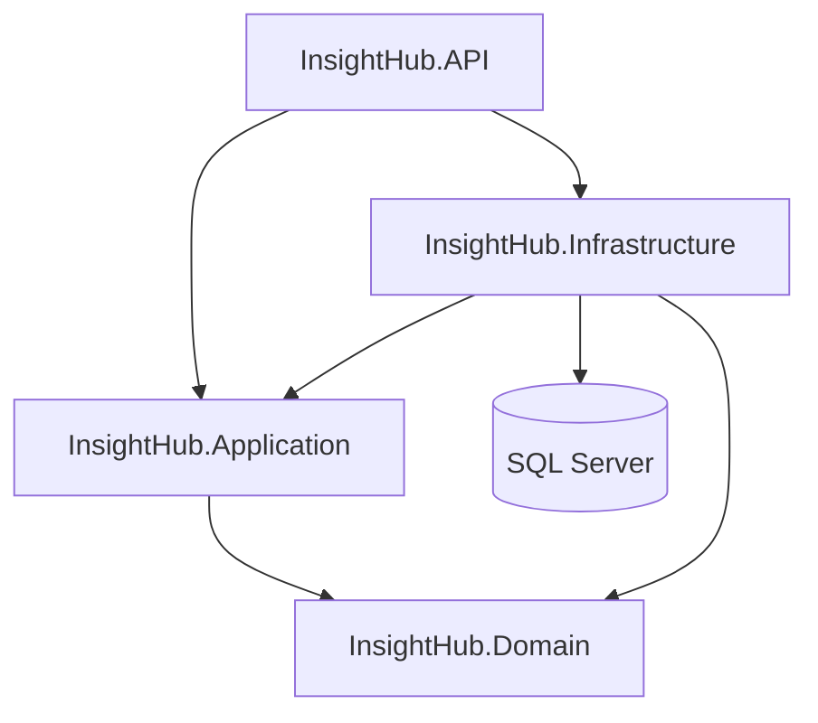
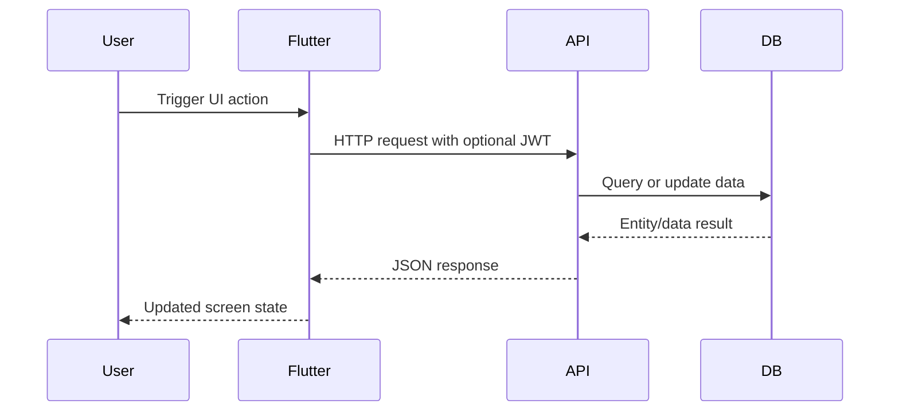
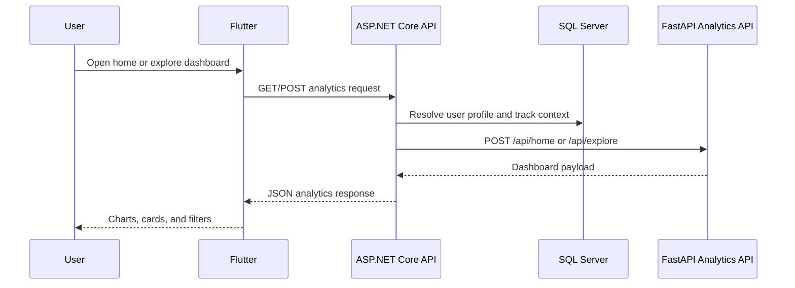
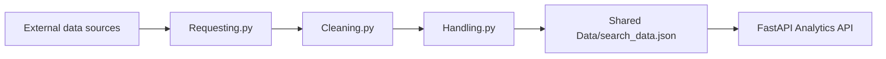

# InsightHub

## Project Overview

InsightHub is a multi-service career guidance and labor-market intelligence platform built for a graduation project. It combines a Flutter client, an ASP.NET Core backend, and a Python analytics service to support authentication, assessments, profile management, job/news discovery, and analytics-driven dashboards.

Core capabilities include:

- Account registration, login, OTP verification, profile management, and account deletion
- Employee survey flow and non-employee career matching flow
- HR interview quiz generation and scoring
- Jobs and news retrieval by track/category
- Analytics dashboards for personalized home and explore views
- Scheduled ingestion and refresh workflows for market data

## User Guide

This section explains how to run the current project locally after cloning the repository.

### Repository Layout

| Path | Role |
| --- | --- |
| `src/Backend Department` | ASP.NET Core Web API solution |
| `src/Analytics Department` | FastAPI analytics service and data pipeline |
| `src/Flutter Department` | Flutter client application |

### Required Software

| Tool | Recommended Version | Why it is needed |
| --- | --- | --- |
| Git | Latest | Clone and update the repository |
| .NET SDK | 10.0 | Required by all backend projects targeting `net10.0` |
| SQL Server | 2019+ / Express / LocalDB | Main backend database and Hangfire storage |
| Python | 3.10+ | Analytics API and pipeline scripts |
| Flutter SDK | Stable release compatible with Dart `^3.9.2` | Client runtime and build toolchain |
| ODBC Driver 17 for SQL Server | Current Windows driver | Required by the analytics data pipeline when using SQL Server |

### Current Technology Stack

| Layer | Technologies |
| --- | --- |
| Frontend | Flutter, Dart, `flutter_bloc`, `dio`, `flutter_dotenv`, `flutter_secure_storage`, Syncfusion charts/maps/treemap |
| Backend | ASP.NET Core, EF Core, SQL Server, ASP.NET Identity, JWT, Hangfire, Swagger/OpenAPI |
| Analytics | FastAPI, Uvicorn, Pandas, NumPy, SQLAlchemy, spaCy, `python-dotenv` |
| External integrations | Adzuna Jobs API, NewsAPI |

### 1. Clone the Repository

```powershell
git clone <repository-url>
cd InsightHub
```

### 2. Backend Setup

The backend solution contains four projects:

- `InsightHub.API`
- `InsightHub.Application`
- `InsightHub.Domain`
- `InsightHub.Infrastructure`

#### Restore dependencies

```powershell
dotnet restore "src/Backend Department/InsightHub.sln"
```

#### Create local backend configuration

Create this file:

`src/Backend Department/InsightHub.API/appsettings.Development.json`

```json
{
  "ConnectionStrings": {
    "DefaultConnection": "Server=localhost;Database=InsightHub;Trusted_Connection=True;TrustServerCertificate=True"
  },
  "Jwt": {
    "Key": "replace-with-a-long-random-secret",
    "Issuer": "InsightHub",
    "Audience": "InsightHub.Client"
  },
  "DataAnalysis": {
    "BaseUrl": "http://127.0.0.1:8000"
  },
  "Adzuna": {
    "AppId": "your-adzuna-app-id",
    "AppKey": "your-adzuna-app-key"
  },
  "NewsApi": {
    "ApiKey": "your-newsapi-key"
  }
}
```

#### Database setup

The backend uses:

- Entity Framework Core for persistence
- SQL Server as the primary database
- ASP.NET Identity for users/authentication
- Hangfire with SQL Server storage for recurring jobs

Apply existing migrations:

```powershell
dotnet ef database update --project "src/Backend Department/InsightHub.Infrastructure" --startup-project "src/Backend Department/InsightHub.API"
```

If `dotnet ef` is not installed:

```powershell
dotnet tool install --global dotnet-ef
```

#### Run the backend

```powershell
dotnet run --project "src/Backend Department/InsightHub.API"
```

Current local development URL from [launchSettings.json](</D:/Graduation Projects/Comp Project/InsightHub/src/Backend Department/InsightHub.API/Properties/launchSettings.json>):

- `http://localhost:5043`

Important startup behavior:

- Swagger UI is enabled in development mode.
- Hangfire server starts automatically.
- Seed routines run on startup.
- `DummyDataSeeder` can create a large batch of dummy market users and responses on first run, so the first startup may take longer than subsequent runs.

### 3. Analytics Service Setup

The analytics section has two distinct parts:

- `Analytics & Visualization`: FastAPI dashboard service
- `Cleaning & Modeling`: data collection, cleaning, caching, and refresh pipeline

#### Create and activate a virtual environment

```powershell
python -m venv .venv
.venv\Scripts\activate
```

#### Install Python dependencies

```powershell
pip install -r "src/Analytics Department/requirements.txt"
```

#### Configure analytics environment variables

Create or update:

- `src/Analytics Department/.env`

Use [env example.txt](</D:/Graduation Projects/Comp Project/InsightHub/src/Analytics Department/env example.txt>) as the template.

Recommended local values:

```dotenv
ADZUNA_API_ID=
ADZUNA_APP_KEY=

ANALYST_HOST=127.0.0.1
CHARTS_PORT=8000

DB_TYPE=mssql+pyodbc
DB_DRIVER=ODBC Driver 17 for SQL Server
DB_USER=your_db_user
DB_PASSWORD=your_db_password
BACKEND_HOST=127.0.0.1
DB_PORT=1433
DB_NAME=InsightHub
```

#### Run the analytics API

```powershell
cd "src/Analytics Department/Analytics & Visualization"
python main.py
```

The analytics API exposes:

- `POST /api/home`
- `POST /api/explore`

#### Optional: run the analytics refresh pipeline

The file [update.py](</D:/Graduation Projects/Comp Project/InsightHub/src/Analytics Department/Cleaning & Modeling/update.py>) is not a one-shot script. It runs as a long-lived scheduled process that repeatedly refreshes analytics data and tracks its own run state.

Run it in a separate terminal only if you want the local environment to refresh market data continuously:

```powershell
cd "src/Analytics Department/Cleaning & Modeling"
python update.py
```

Notes:

- The analytics API reads `src/Analytics Department/Shared Data/search_data.json` at startup.
- That file exists in the current repository state.
- If it becomes missing or stale, the analytics API will still start, but dashboard results may be empty or outdated until the pipeline refreshes the shared data.

### 4. Flutter Client Setup

The Flutter app has been refactored into a more modular structure centered around:

- `lib/core`
- `lib/feature`

Legacy folders such as `lib/views`, `lib/widget`, `lib/services`, and `lib/cuibt` still exist alongside the newer feature-based structure, so the current app is partially transitional.

#### Install dependencies

```powershell
cd "src/Flutter Department"
flutter pub get
```

#### Create the Flutter environment file

The app now loads configuration from `.env` using `flutter_dotenv`.

Copy:

- `src/Flutter Department/.env.example`

to:

- `src/Flutter Department/.env`

Example content for local backend access:

```dotenv
BASE_URL=http://localhost:5043/api
```

If you run the app on an Android emulator, use:

```dotenv
BASE_URL=http://10.0.2.2:5043/api
```

If you run on a physical device, use the host machine IP reachable from the device.

#### Run the Flutter app

```powershell
flutter run
```

### 5. Recommended Local Startup Order

Start the system in this order:

1. SQL Server
2. Analytics API
3. ASP.NET Core backend
4. Flutter client
5. Optional analytics refresh pipeline

Why this order matters:

- The backend requires a working database connection.
- The backend proxies dashboard requests to the analytics API.
- The Flutter client depends on the backend base URL.
- The optional analytics refresh pipeline updates the shared analytics dataset used by the FastAPI service.

### 6. Docker

No `Dockerfile` or `docker-compose` files are present in the current repository state.

### 7. Troubleshooting

| Issue | Likely cause | Action |
| --- | --- | --- |
| Backend fails with `Jwt:Key is missing` | Missing backend config file | Create `appsettings.Development.json` with the `Jwt` section |
| Backend fails to start Hangfire or EF Core | Invalid SQL Server connection string | Verify `ConnectionStrings:DefaultConnection` |
| Backend analytics endpoints return empty payloads | Analytics API unreachable or shared data missing | Start the analytics API and verify `DataAnalysis:BaseUrl` |
| Flutter app cannot connect to API | `BASE_URL` not set correctly in `.env` | Update `src/Flutter Department/.env` |
| Flutter login/register succeeds inconsistently across screens | Some legacy frontend files still coexist with new services | Prefer flows wired through `lib/core/services/api_service.dart` |
| Analytics data is stale | Refresh pipeline not running | Run `python update.py` in `Cleaning & Modeling` if you need live refresh behavior |
| News/jobs ingestion is empty | Missing Adzuna or NewsAPI credentials | Configure `Adzuna` and `NewsApi` keys in backend config |
| Analytics pipeline cannot connect to SQL Server | Missing ODBC driver or wrong DB credentials | Install ODBC Driver 17 and verify analytics `.env` values |

## System Design & Architecture

### High-Level Architecture

InsightHub is organized as a client application backed by two server-side components: a transactional API and a dedicated analytics service.



### Backend Architecture

The backend uses a layered .NET architecture.



| Layer | Responsibility |
| --- | --- |
| `InsightHub.API` | Controllers, auth, middleware, rate limiting, startup configuration |
| `InsightHub.Application` | Interfaces and DTO/view-model contracts |
| `InsightHub.Domain` | Core entities and enums |
| `InsightHub.Infrastructure` | EF Core persistence, seeding, migrations, external services, DI registrations |

### Main Modules

#### Backend

Important backend controllers:

| Controller | Responsibility |
| --- | --- |
| `AccountController` | Registration, login, OTP, profile, logout, account deletion |
| `SurveyController` | Employee assessment questions and submission |
| `CareerQuizController` | Non-employee question flow and stored result retrieval |
| `InterviewQuizController` | Track-specific interview questions and submission |
| `UserSubmission` | Employment-status navigation decision input |
| `NewsController` | Category-based news retrieval |
| `JobOffersController` | Category-based related jobs retrieval |
| `AnalysisProxyController` | Proxies home/explore analytics requests to the FastAPI service |

Important backend services:

| Service | Responsibility |
| --- | --- |
| `AccountService` | Identity, JWT generation, OTP, profile updates |
| `SurveyService` | Employee survey workflow |
| `CareerQuizService` | Career-matching logic and result storage |
| `InterviewQuizService` | Interview quiz retrieval and scoring |
| `UserSubmissionService` | Profile-driven navigation state |
| `JobOffersQueryService` | Job retrieval layer |
| `NewsQueryService` | News retrieval layer |
| `JobSyncService` | Scheduled jobs synchronization |
| `NewsIngestionService` | Scheduled news ingestion |
| `InterviewQuestionsSyncService` | Scheduled interview question sync |
| `AdzunaService` | External jobs API client |
| `NewsService` | External news API client |

#### Analytics

The analytics service is designed around a reusable analyzer and dynamic page configuration.

| Module | Responsibility |
| --- | --- |
| `Analytics.py` | `Analyzer` class for KPI, distribution, and time-series operations |
| `Configs.py` | Dashboard widget definitions for home and explore pages |
| `Routes.py` | Dynamic page endpoint registration |
| `Services.py` | Page response assembly using `PageBuilder` |
| `main.py` | FastAPI application startup and route wiring |
| `Cleaning & Modeling/update.py` | Long-running scheduled data refresh pipeline |
| `Cleaning & Modeling/Requesting.py` | API client layer for data acquisition |
| `Cleaning & Modeling/Handling.py` | Local data handling utilities |
| `Cleaning & Modeling/Caching.py` | Cache management |
| `Cleaning & Modeling/Cleaning.py` | Large data-cleaning and transformation layer |

#### Flutter

The frontend is now primarily feature-based:

| Folder | Responsibility |
| --- | --- |
| `lib/core` | Configuration, API services, storage, shared utilities |
| `lib/feature/app_start` | Splash, onboarding, and app-entry views |
| `lib/feature/auth` | Registration, login, OTP, and auth-specific widgets/cubits |
| `lib/feature/home_and_explore` | Dashboard, explore/search, dynamic chart rendering |
| `lib/feature/menu_Services/career_and_hr` | Career quiz, HR quiz, match flows |
| `lib/feature/menu_Services/jop_and_news` | Jobs and news features |

The repository still contains older folders such as `lib/views`, `lib/widget`, `lib/services`, and `lib/cuibt`, so the codebase currently mixes newer modular structure with legacy modules.

### API and Data Flow

#### Standard application flow



#### Analytics proxy flow



#### Analytics refresh flow



### Database Structure

Primary persistence is implemented through [AppDbContext.cs](</D:/Graduation Projects/Comp Project/InsightHub/src/Backend Department/InsightHub.Infrastructure/Persistence/AppDbContext.cs>).

Key persisted concepts:

- users and identity data
- tracks and category labels
- survey questions, options, and responses
- career quiz results and per-track scores
- interview questions and answer options
- job offers
- news articles

Important operational details:

- `SurveyResponse` has a uniqueness constraint on `(UserId, QuestionId)`.
- `JobOffer.ExternalId` is unique.
- `QuizResult` to `QuizResultTrack` is configured with cascade delete.
- Startup seeding initializes baseline data and synthetic market users.

### Scheduled Services

The backend schedules recurring jobs through Hangfire:

- job sync: daily at 1:00
- news ingestion: every 12 hours
- interview question sync: weekly on Saturday

These jobs complement the request/response API by keeping locally stored content fresh.

## Implementation Overview

### Implementation Approach

InsightHub is implemented as three cooperating runtimes with separate responsibilities:

- Flutter handles user interaction, navigation, local token persistence, and dashboard rendering.
- ASP.NET Core owns authentication, business logic, persistence, scheduled jobs, and API composition.
- FastAPI focuses on analytics computation and dashboard payload generation over prepared market data.

This separation keeps the transactional system and the analytics workload decoupled.

### Core Engineering Decisions

| Decision | Why it matters |
| --- | --- |
| Layered backend design | Keeps HTTP, contracts, domain rules, and infrastructure separated |
| Dedicated analytics service | Avoids embedding Pandas-heavy processing in the main API |
| Backend analytics proxy | Allows user-aware filtering before dashboard requests reach analytics |
| Feature-based Flutter structure | Scales UI code by domain instead of by file type alone |
| JWT + secure local storage | Supports authenticated mobile/web flows with centralized token handling |
| Hangfire recurring jobs | Provides operational scheduling without a custom scheduler |
| Seeded development data | Makes local demos and testing more realistic on first run |

### Processing Pipelines

#### Authentication and profile pipeline

1. Flutter sends credentials or profile changes through `ApiService`.
2. `AccountController` delegates to `AccountService`.
3. Identity/JWT logic runs in the backend.
4. Tokens are stored client-side using secure storage.
5. Unauthorized responses are centrally handled by the frontend service layer.

#### Assessment pipeline

1. The app checks employment status through `UserSubmission`.
2. Based on the response, the user is routed to survey, career quiz, result, or thank-you flows.
3. Answers are submitted to `SurveyController`, `CareerQuizController`, or `InterviewQuizController`.
4. Results are stored and later reloaded through backend services.

#### Dashboard pipeline

1. The analytics service loads `search_data.json` into a Pandas DataFrame at startup.
2. `Analyzer` computes the required metrics.
3. `PageBuilder` assembles widget payloads based on config-defined resolvers.
4. The backend proxies dashboard requests and adds user-aware filters when needed.
5. Flutter renders dynamic dashboard cards and charts using Syncfusion components.

### Patterns and Structural Characteristics

Patterns visible in the current codebase:

- dependency injection in ASP.NET Core
- interface-based service abstraction in the application layer
- builder/configuration-driven response composition in analytics
- Cubit/BLoC state management in Flutter
- centralized HTTP client handling in the Flutter client

### Scalability and Optimization Considerations

Current strengths:

- analytics workload is isolated from the transactional backend
- recurring ingestion is offloaded to Hangfire jobs
- external API access is wrapped behind service classes
- dashboard rendering is driven by API payloads rather than hardcoded screen logic
- client requests share a centralized `Dio`-based service layer

Current constraints visible in the repository:

- the Flutter codebase still contains legacy and refactored modules side by side
- the backend requires manual local config bootstrapping
- analytics startup depends on an in-memory DataFrame loaded from shared JSON
- external data freshness depends on scheduled jobs or the long-running Python refresh process
- some legacy frontend files still reference older service code paths

### Technical Challenges Inferred from the Codebase

The implementation suggests the team had to solve practical integration problems rather than only UI concerns:

- coordinating three runtimes with different stacks
- keeping dashboard analytics aligned with backend DTOs and frontend rendering
- routing users into different assessment flows based on employment status
- combining stored application data with externally ingested jobs and news
- balancing a refactor of the Flutter app while retaining some legacy code during transition

Overall, the updated repository reflects a realistic graduation-project architecture: modular, service-oriented, and strong enough to support both interactive product flows and background data-refresh processes.
